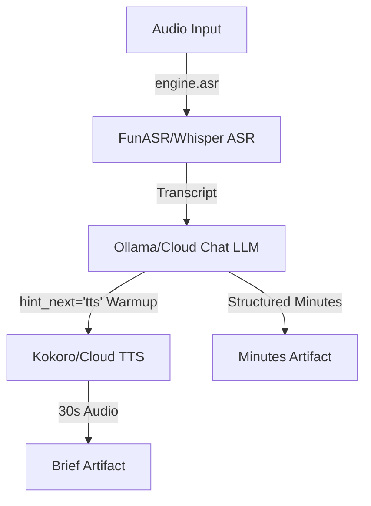

# Scenario S1: Meeting Recording → Minutes + Executive Brief

This document provides a detailed end-to-end verification and user guide for Scenario S1 of the MoFA Engine.

## 1. Scenario Overview
- **What S1 is**: Meeting/Lecture Recording → Structured Minutes + 30s Audio Brief.
- **PRD Reference**: §3, Scenario S1 (lines 513-612).
- **Priority**: P2 (Must), Week 4 delivery.
- **Business Context**: Enterprises generate massive meeting recordings daily (standups, client communication, training), needing searchable minutes and audible briefs. Because such content is often highly confidential (strategy, compensation, legal), data must not be sent to the cloud. Therefore, local-first execution is a hard requirement, not just a nice-to-have. The scenario delivers two tangible artifacts: a structured minutes document and a 30-second audio brief suitable for listening on a commute.

## 2. Pipeline Architecture
The pipeline consists of three sequential steps, leveraging predictive warmup and strict routing constraints.



- **3-Step Pipeline**: Audio goes through ASR for transcription with speaker separation, then to a Chat LLM to extract structured minutes, and finally the executive summary is sent to TTS to produce an audio brief.
- **Warmup (`hint_next="tts"`)**: Emitted during the Chat extraction step (Step 2) to proactively load the TTS model before Step 3, eliminating the cold start latency for audio synthesis.
- **Routing (`prefer="local"`)**: Acts as a hard constraint. If local models are requested but unavailable, the pipeline will fail gracefully rather than silently falling back to cloud providers, thereby guaranteeing zero data egress for confidential meetings.

## 3. Required Infrastructure

| Component | Local Provider | Cloud Fallback | Port | Status |
| --- | --- | --- | --- | --- |
| **MoFA Engine Core** | Gateway Daemon | - | 8420 | Required |
| **ASR** | FunASR (`local_asr`) | Whisper (`whisper-1`) | - | Required |
| **Chat LLM** | Ollama (`qwen2.5:7b` or `gemma3:4b`) | Fireworks AI | 11434 | Required |
| **TTS** | Kokoro (`af_heart`) | OpenAI TTS | 8421 | Required |

*Note: FunASR is configured as `local_asr` in `mofa_hybrid.toml`.*

## 4. Setup Instructions

Step-by-step setup for running the scenario:

```bash
# 1. Start MoFA Engine
bash quickstart.sh

# 2. Verify all services
bash quickstart.sh --status

# 3. Ensure Ollama has a model
ollama pull qwen2.5:7b

# 4. Verify engine health
curl http://127.0.0.1:8420/health
```

## 5. How to Run

### 5a. Live Mode (Local-First)
Run with strict local-first privacy constraint.
```bash
python3 examples/meeting_brief.py --audio examples/samples/sample_meeting.wav --prefer local
```

### 5b. Live Mode (Cloud Fallback)
Run allowing cloud endpoints.
```bash
python3 examples/meeting_brief.py --audio examples/samples/sample_meeting.wav --prefer cloud
```
*Note: Cloud mode requires the `FIREWORKS_API_KEY` environment variable to be set.*

### 5c. Mock Mode (No Engine Required)
Run a simulated fast-path for demonstrations without an active engine.
```bash
python3 examples/meeting_brief.py --mock
```

## 6. Expected Output

The script produces console output detailing step-by-step progress, including execution times and routing choices. It generates two tangible output artifacts:
1. `output/meeting_minutes.md` - Structured minutes containing resolutions, todos, risks, and responsible persons.
2. `output/meeting_brief.mp3` - 30-second audio brief summarizing the meeting.

**Sample Console Output**:
```text
==========================================================================
 Scenario S1: Meeting Recording -> Minutes & Executive Brief
==========================================================================
 • Input Audio: examples/samples/sample_meeting.wav
 • Preference : prefer=local (Local (Privacy-Preserving))
 • Mode : LIVE (MoFA Gateway)

 [Step 1/3] Transcribing Meeting Audio with Speaker Diarization...
 ├─ Provider Used : funasr (local)
 ├─ Step Latency : 1.24s
 └─ Transcript Snippet:
 [00:00:05] Speaker 1 (Alice): Good morning team...

 [Step 2/3] Extracting Minutes & Action Items via LLM (hint_next='tts')...
 ├─ Provider Used : ollama (local)
 ├─ Step Latency : 1.85s
 └─ Preflight : Emitted hint_next='tts' (predictive warmup for narration)
 Saved Meeting Minutes: output/meeting_minutes.md

 [Step 3/3] Synthesizing 30s Executive Voice Brief (TTS)...
 ├─ Provider Used : kokoro (local)
 ├─ Step Latency : 0.82s
 └─ Audio Artifact: output/meeting_brief.mp3

==========================================================================
 SCENARIO S1 MEETING BRIEF COMPLETED SUCCESSFULLY!
 Output Artifacts:
 ├─ Minutes Document : /Users/ashum9/mofa/mofa-engine/output/meeting_minutes.md
 └─ Audio Brief (.mp3): /Users/ashum9/mofa/mofa-engine/output/meeting_brief.mp3
 Total Pipeline Time : 3.91s
 Total Inference Cost : $0.000000 (100% Free)
==========================================================================
```

## 7. What Each Step Does (Technical Detail)
- **Step 1 (ASR)**: Sends the long audio to the engine's ASR capability via `engine.asr`. When `prefer="local"`, local FunASR processes the audio to produce a transcript with speaker diarization (speaker attribution).
- **Step 2 (Chat Extraction)**: Sends the transcript to the LLM via `engine.chat(..., hint_next="tts")`. The system prompt instructs the model to extract structured minutes (resolutions, todos, risks). The `hint_next="tts"` parameter tells the MoFA engine to begin warming up the TTS model immediately, reducing the latency for the subsequent step.
- **Step 3 (TTS Synthesis)**: Sends the extracted summary paragraph to `engine.tts` (e.g., using the `"en-narrator"` voice alias which may resolve to `"af_alloy"` or `"af_heart"`). The generated audio is saved as an `.mp3` file for offline listening.

## 8. PRD Acceptance Criteria Verification

| PRD Criterion | Test Method | Expected Result |
| --- | --- | --- |
| **Long Audio ASR processing** | Submit 1h audio file to FunASR locally. | Total processing time < 8 minutes, with speaker separation included. |
| **`prefer=local` hard constraint** | Run `prefer="local"` and simulate local service failure (e.g., stop Ollama). | Pipeline fails gracefully. Must not silently fallback to cloud processing (0% cloud). |
| **Minutes + Brief artifact output** | Check the `output/` directory after execution. | Structured `meeting_minutes.md` and `meeting_brief.mp3` are present. |
| **`hint_next` warmup effective** | Compare Step 3 latency with and without passing `hint_next="tts"` in Step 2. | TTS cold start time is quantifiably reduced when the hint is present. |

## 9. Troubleshooting
- **ASR fails**: Ensure FunASR is configured correctly as `local_asr` in `mofa_hybrid.toml` and that the audio file exists and contains actual speech.
- **TTS fails**: Check that the Kokoro TTS service is running on port `8421`. 
- **LLM timeout**: Verify that Ollama is running on port `11434` and that the required model (e.g., `qwen2.5:7b`) is loaded. 

## 10. Sample Files
- `sample_meeting.wav`: A 13-second recording of real human speech located at `examples/samples/sample_meeting.wav`.
- **Output Directory**: Artifacts are automatically written to the `output/` directory within the working folder.
