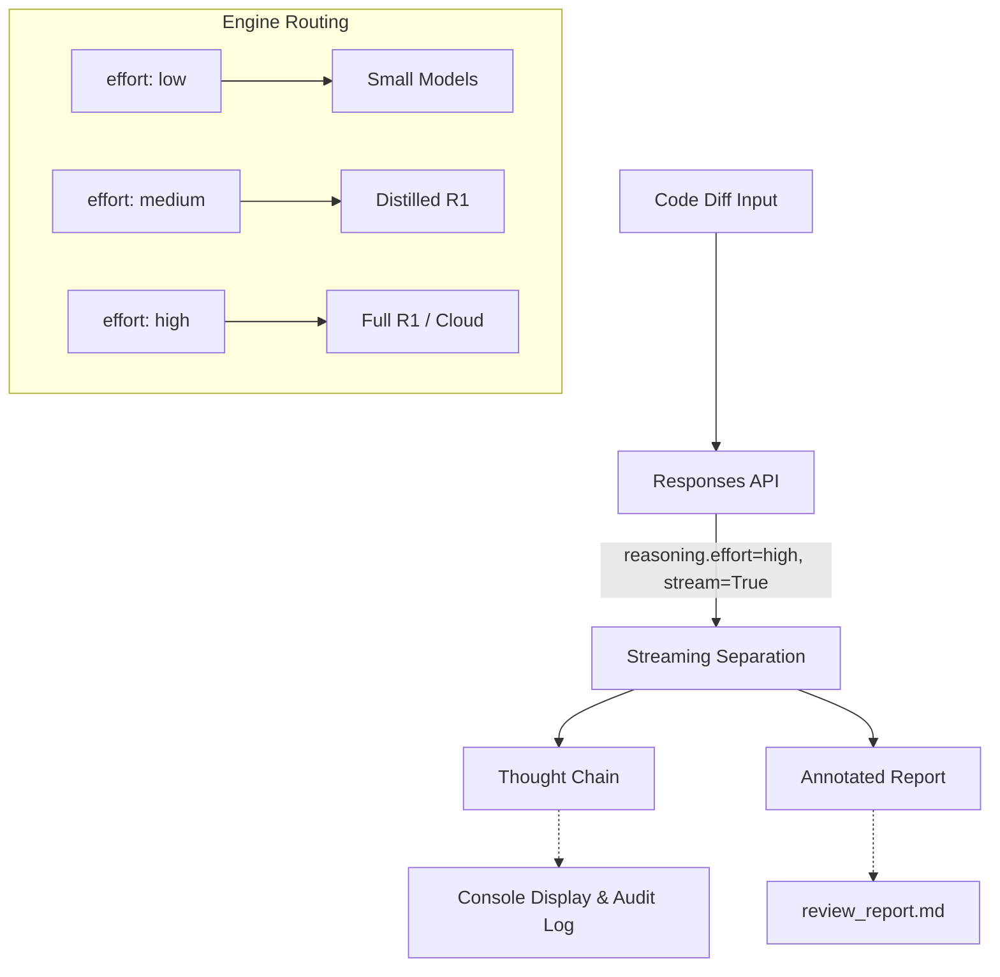

# Scenario S2: Code/PR Review Agent

## 1. Scenario Overview
- **What S2 is:** Feed a git diff or code patch to a reasoning model which then produces an annotated code review report with severity ratings (blocker/major/minor) and fix suggestions.
- **PRD reference:** §3 Scenario S2 (lines 613-725)
- **Priority:** P1 (Must), Week 3 mount (reuses Responses API)
- **Business context:** Addresses heavy PR and contract review burden, provides a visible inference process, and generates traceable reports for auditing and compliance.

## 2. Pipeline Architecture


## 3. Required Infrastructure
| Component | Local Provider | Cloud Fallback | Port | Notes |
| :--- | :--- | :--- | :--- | :--- |
| MoFA Engine Core | Local Daemon | - | 8420 | Gateway daemon running |
| Reasoning Model | Ollama (qwen2.5:7b / deepseek-r1) | Fireworks (deepseek-v4) | 11434 | local models rate-limited by max_concurrency |

## 4. Setup Instructions
```bash
bash quickstart.sh
bash quickstart.sh --status
ollama pull qwen2.5:7b
```

## 5. How to Run

### 5a. Review a local diff file
```bash
python3 examples/code_review.py --diff-file examples/samples/sample_diff.patch --prefer local
```

### 5b. Review from git diff (pipe)
```bash
git diff HEAD~1 | python3 examples/code_review.py --prefer local
```

### 5c. Mock Mode
```bash
python3 examples/code_review.py --mock
```

## 6. Expected Output
- The console will display a streaming thought chain (reasoning tokens in dim gray) followed by the final review output (bold white).
- A file `output/review_report.md` will be generated containing:
  - Issue annotations (severity: blocker/major/minor)
  - Fix suggestions
  - Summary statistics (tokens, streaming velocity, cost)

## 7. Technical Detail
- Uses `engine.responses()` with `reasoning={"effort": "high"}` and `stream=True`.
- The Responses API maps to the engine's chat capability with true streaming.
- Thought chain tokens (`type="reasoning"`) are separated from output tokens (`type="output"`) in the SSE stream.
- The `effort` level (low/medium/high) handles routing to different model tiers (Local small vs Distilled R1 vs Full R1).

## 8. PRD Acceptance Criteria
| PRD Criterion | Test Method | Expected Result |
| :--- | :--- | :--- |
| Responses API available with reasoning.effort routing | Run `code_review.py` with valid diff | Correct tier models hit based on effort |
| Streaming distinguishes reasoning and output | Run with true streaming | Event count verification (both types present) |
| Thought tokens separately metered | Check summary statistics | Token count displayed separately |
| Failure returns structured error | Force failure (e.g. invalid endpoint) | Structured error returned allowing retry |

## 9. Troubleshooting
- **No streaming output:** Check if the engine supports SSE streaming and `MofaEngine.responses` API is correctly mounted.
- **Model timeout:** Reasoning-heavy prompts can take 30-60s with local models. Use smaller diffs or verify model residency.
- **Empty diff:** Ensure you provide actual code changes when piping `git diff`.

## 10. Sample Files
- `sample_diff.patch` (573 bytes) located in `examples/samples/`
