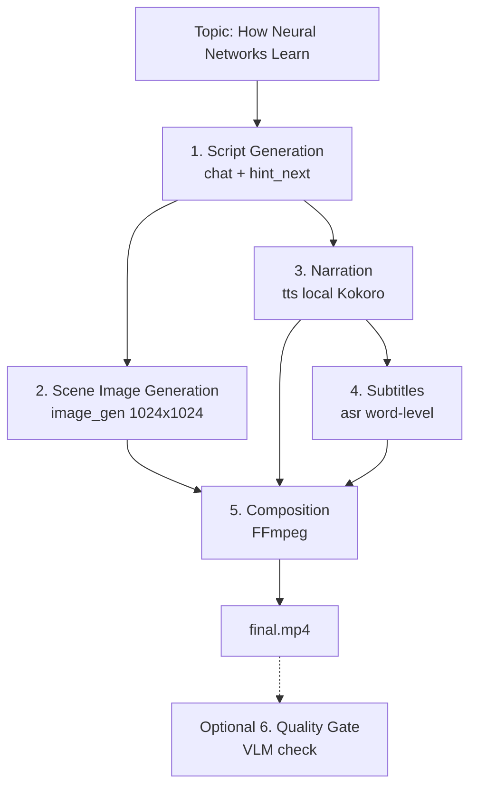

# Scenario S4: Flagship Explainer Video

This is a detailed end-to-end verification and user guide for Scenario S4: Flagship Explainer Video.

## 1. Scenario Overview
- What S4 is: The FLAGSHIP scenario. One-sentence topic → finished mp4 video with narration, subtitles, multi-scene visuals
- PRD reference: §3 Scenario S4 (lines 802-905)
- Priority: P1 (Must), Week 2 v1 / Week 3 v2
- Business context: Natural language in → publishable explainer video, benchmarking OpenMontage
- This is the most complex pipeline: Chat+ImageGen+TTS+ASR+VLM quality check

## 2. Pipeline Architecture  


## 3. Required Infrastructure
| Component | Local Provider | Cloud Fallback | Port | Notes |
| :--- | :--- | :--- | :--- | :--- |
| MoFA Engine Core | - | - | 8420 | Central orchestrator |
| Script Gen | Ollama (qwen2.5:7b) | Fireworks AI | 11434 | For script generation |
| TTS (Narration) | Kokoro (af_heart) | Cloud tts-1 | 8421 | For voice synthesis |
| ASR (Subtitles) | FunASR | whisper-1 | - | Extracts word-level timestamps |
| ImageGen | Stable Diffusion | FLUX/DALL-E | - | For scene images |
| Composition | FFmpeg | - | - | System binary |
| VLM (Quality Gate) | LLaVA (Optional) | GPT-4o | - | For image-text match check |

## 4. Setup Instructions
```bash
bash quickstart.sh
ollama pull qwen2.5:7b
# FFmpeg is required for video composition:
brew install ffmpeg  # macOS
# For local image generation, need a Stable Diffusion server
# For cloud image generation, need API keys
```

## 5. How to Run

### 5a. Full pipeline (local-first)
```bash
python3 examples/explainer_video.py --topic "How Neural Networks Learn" --prefer local
```

### 5b. Mock Mode
```bash
python3 examples/explainer_video.py --topic "How Neural Networks Learn" --mock
```

## 6. Expected Output
- Console shows 5-step progress with timing
- `output/explainer_video.mp4` - finished video
- Temp directory with scene images, narration audio, subtitle file

## 7. Technical Detail  
- Step 1 uses `engine.chat()` with `hint_next="image_gen"` to warm up image generation
- Step 2 uses `engine.image_gen()` for each scene - currently needs a local SD server or cloud
- Step 3 uses `engine.tts()` - Kokoro handles this locally
- Step 4 uses `engine.asr()` for word-level timestamps
- Step 5 uses FFmpeg subprocess for composition (not engine, thin pipeline runner)
- Each step can independently fallback (local→cloud)

## 8. PRD Acceptance Criteria
| PRD Criterion | Test Method | Expected Result |
| :--- | :--- | :--- |
| Finished video artifact | Run full script | mp4 with subtitles + narration |
| ImageGen supports text-to-image | Run ImageGen API | Correct size / URL |
| Quality gate | Run pipeline | ffprobe duration + slideshow-risk checked |
| Heavy model warmup | Check console logs | hint_next warms models |
| Offline closed loop | Network off | Ollama + local SD + local TTS run fine |
| Dual-track cost display | Engine /cost endpoint | Displays local ($0) & cloud cost |

## 9. Current Limitations (Honest Assessment)
- Image generation: `stable_diffusion` provider is configured but points to the engine itself (8420), needs a real SD backend
- VLM quality gate: Optional, needs llava model
- Video composition: Requires FFmpeg installed system-wide
- Full offline: Only possible if ALL local backends (SD, Ollama, Kokoro, FunASR) are running

## 10. Troubleshooting
- No image_gen backend: Falls back to placeholder images or cloud
- FFmpeg not found: Install via brew/apt
- Slow generation: 5-step pipeline can take 2-5 minutes depending on hardware

## 11. Sample Topic Suggestions
- "How Neural Networks Learn"
- "The Water Cycle Explained"
- "How Encryption Works"
