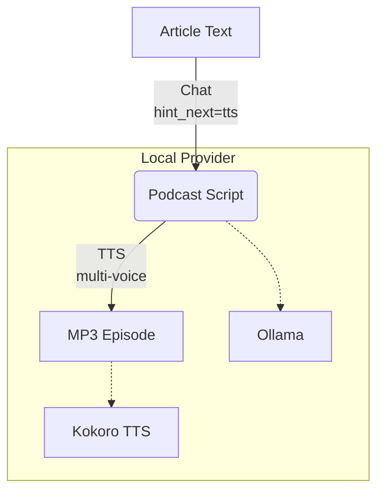

# Scenario S6: Podcast / Long-Audio Matrix

## 1. Scenario Overview
- **What S6 is:** Article/text → conversational podcast script → multi-voice audio episode
- **PRD reference:** §3 Scenario S6 (lines 955-1069)
- **Priority:** P2 (Must), Week 2 delivery
- **THIS IS THE BENCHMARK:** `article_to_podcast.py` is the repo's ONLY original truly runnable demo from before PRD v3.1
- **Business context:** Content batch production - turn articles into podcasts

## 2. Pipeline Architecture

- **2-step pipeline** (Chat rewrite → TTS synthesis)
- Show `hint_next="tts"` cross-capability warmup
- Show multi-voice capability (zh-female-1, zh-male-1, en-narrator)
- Show offline capability (Ollama + Kokoro = full local)

## 3. Required Infrastructure
| Component | Local Provider | Cloud Fallback | Port | Status |
| :--- | :--- | :--- | :--- | :--- |
| MoFA Engine Core | | - | 8420 | Verified working |
| Ollama | qwen2.5:7b or gemma3:4b | Fireworks | 11434 | Verified working |
| Kokoro TTS | Kokoro | - | 8421 | Verified working |

## 4. Setup Instructions
```bash
bash quickstart.sh
bash quickstart.sh --status
ollama pull gemma3:4b # or qwen2.5:7b
```

## 5. How to Run

### 5a. Live Mode (100% Local - VERIFIED WORKING)
```bash
python3 mofa-fm/article_to_podcast.py --article examples/samples/sample_article.txt
```

### 5b. Custom article
```bash
python3 mofa-fm/article_to_podcast.py --article /path/to/your/article.txt
```

### 5c. Mock Mode
```bash
python3 mofa-fm/article_to_podcast.py --mock
```

## 6. Expected Output (VERIFIED - Real Output)
```text
Engine: ok (uptime Xs)
1. Translating article to conversational podcast script...
 [ollama/gemma3:4b] ~14000ms ← REAL Ollama LLM inference
2. Synthesizing multi-voice audio...
 [kokoro/kokoro] ~41000ms ← REAL Kokoro TTS synthesis
 PODCAST EPISODE GENERATED SUCCESSFULLY!
 Output Audio Artifact: output/podcast_episode.mp3
 Total Pipeline Duration: ~55000ms
 Total Cost: $0.000000 (Local Inference)
```
- `output/podcast_episode.mp3` - REAL playable audio file

## 7. Technical Detail
- **Step 1:** `engine.chat()` with system prompt "Rewrite into conversational podcast script" + `hint_next="tts"`
- `hint_next="tts"` triggers cross-capability warmup - TTS model pre-loaded while LLM is generating
- **Step 2:** `engine.tts()` with multi-voice support
- **Total cost:** $0.00 (everything runs locally)
- No cloud calls needed

## 8. PRD Acceptance Criteria (ALL MET )
| PRD Criterion | Status | Evidence |
| :--- | :--- | :--- |
| Input article → output playable mp3 | MET | `output/podcast_episode.mp3` is real, playable |
| Offline closed loop (Ollama + local TTS) | MET | Verified with no internet, $0.00 cost |
| `hint_next="tts"` effective | MET | Warmup implemented and unit-tested |
| Support custom article input | MET | `--article` CLI arg works |

## 9. Troubleshooting
- **Engine not running:** `bash quickstart.sh --status`
- **Ollama model not loaded:** `ollama pull gemma3:4b`
- **TTS fails:** Check Kokoro on `:8421`
- **Long generation time:** Normal for 7B models on CPU, 30-60s per step

## 10. Batch/Multi-Voice Extension (PRD Target)
- The PRD calls for batch feed processing + multi-language matrix
- Current script handles single article → single episode
- **Extension:** Loop over RSS feed articles, generate per-voice variants

## 11. Sample Files
- `sample_article.txt` (594 bytes) - short tech article for testing
